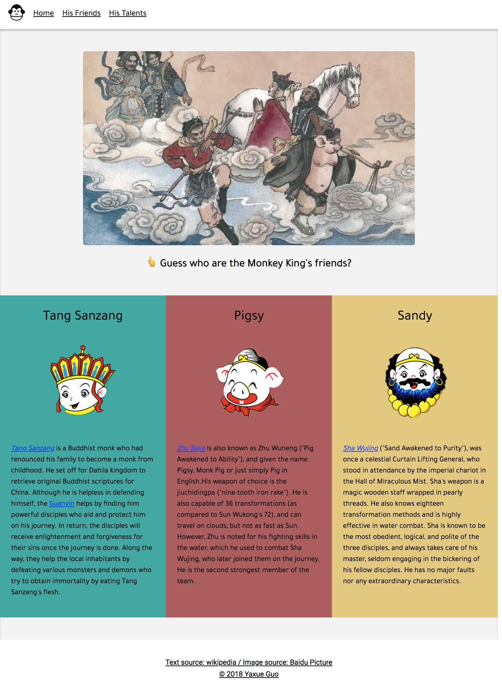

# Introductary Website for Sun Wukong 🐒

The purpose of this website is to introduce a famous Chinese legendary character Sun Wukong, also as known as Qi Tian Da Sheng to people. Grid layout is used for responsive web design. Overall this is a quite simple static website and took me about 4-5 hours in total to design, collect content and develop.

## Technology Stack

HTML5, CSS3, Grid Layout, Flexbox, Responsive Web Design.

## Website at A Glance

 * Homepage. This page uses a complete picture as the background image and decreases the opacity so that Sun Wukong seems to be more mysterious. A brief introduction adds up to the picture and tells audience who Sun Wukong is. The red button is consistent with Wukong's cloak in background in color and can lead audience directly to more detailed introduction for Sun Wukong.
 
 
 
 * Sun Wukong's friends. Audience will first see a ancient painting consisting of several characters including Sun Wukong and his friends. Scrolling down will reveal the answer: who are Wukong's best friends during the journey to retrieve Buddhist sutras from the West.
 
 
 
 * Sun Wukong's talent. This video is the childhood for every Chinese child born in 80's and 90's, which is tailored from the opening and ending songs for a cartoon based on the story of Sun Wukong and his friends. Wukong's talents are also listed as tags for the audience to clearly see. 
 
 
  
## Author
 
 * **Yaxue Guo** independently designed and developed this website.
 
## Acknowledgement

 * Text credits to [wikipedia](https://www.wikipedia.org/).
 
 * Image credits to [Baidu Picture](https://image.baidu.com/).
 
 * Video credits to [Bilibili](https://www.bilibili.com/).
 